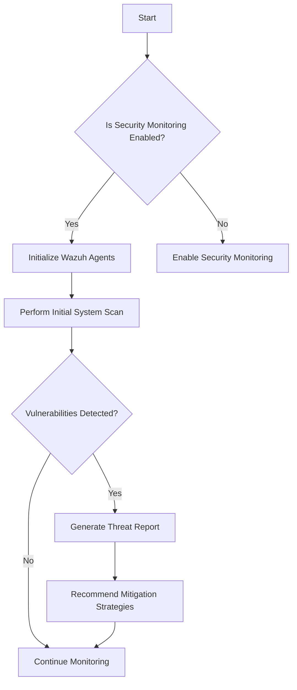
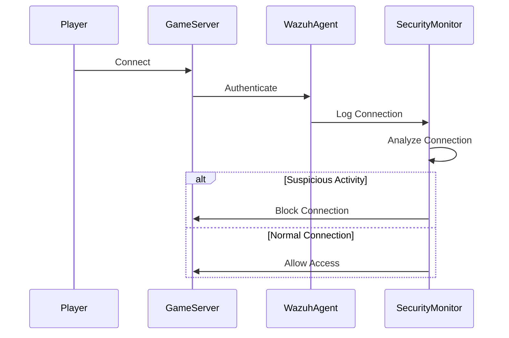
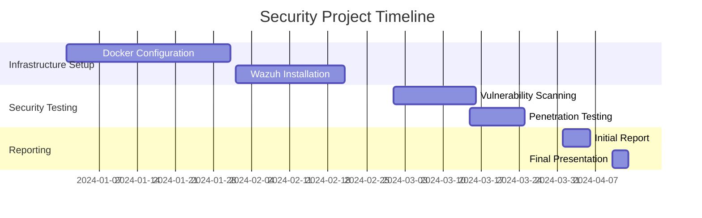

# Visualization Techniques for Technical Documentation

## 1. Flowchart Diagram (Mermaid)

```mermaid
flowchart TD
    A[Start] --> B{Is Security Monitoring Enabled?}
    B -->|Yes| C[Initialize Wazuh Agents]
    B -->|No| D[Enable Security Monitoring]
    C --> E[Perform Initial System Scan]
    E --> F{Vulnerabilities Detected?}
    F -->|Yes| G[Generate Threat Report]
    F -->|No| H[Continue Monitoring]
    G --> I[Recommend Mitigation Strategies]
    I --> H
```

## 2. Sequence Diagram (Mermaid)

```mermaid
sequenceDiagram
    participant Player
    participant GameServer
    participant WazuhAgent
    participant SecurityMonitor
    
    Player->>GameServer: Connect
    GameServer->>WazuhAgent: Authenticate
    WazuhAgent->>SecurityMonitor: Log Connection
    SecurityMonitor->>SecurityMonitor: Analyze Connection
    alt Suspicious Activity
        SecurityMonitor->>GameServer: Block Connection
    else Normal Connection
        SecurityMonitor->>GameServer: Allow Access
    end
```

## 3. Gantt Chart (Mermaid)

```mermaid
gantt
    title Security Project Timeline
    dateFormat  YYYY-MM-DD
    section Infrastructure Setup
    Docker Configuration   :a1, 2024-01-01, 30d
    Wazuh Installation     :a2, 2024-02-01, 20d
    
    section Security Testing
    Vulnerability Scanning :b1, 2024-03-01, 15d
    Penetration Testing    :b2, 2024-03-15, 10d
    
    section Reporting
    Initial Report         :c1, 2024-04-01, 5d
    Final Presentation     :c2, 2024-04-10, 3d
```
